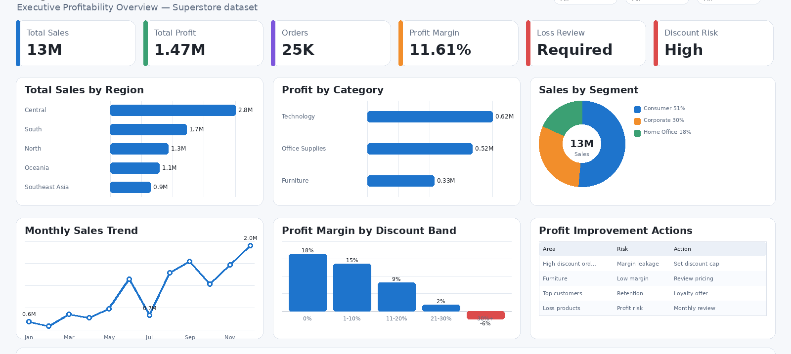

# Superstore Profit, Loss & Retention Analytics

An end-to-end **retail profitability analytics** project using the Superstore dataset. This project analyses sales, profit, loss-making orders, discount impact, product performance, customer segments, and retention signals.

---

## Business Problem

Retail businesses need to understand not only revenue, but also where profit is generated and where loss is hidden.

High sales do not always mean strong business performance. Excessive discounts, low-margin products, inefficient categories, and weak customer retention can reduce profitability.

This project helps answer:

- Which categories and sub-categories generate the most profit?
- Which products or segments create losses?
- How does discounting affect margin?
- Which regions and customer segments are profitable?
- Which customers show repeat purchase behaviour?
- What actions can improve profit and reduce loss?

---

## Dataset

This project uses the Superstore Sales dataset.

Dataset source:

```text
Superstore Sales Dataset
https://www.kaggle.com/datasets/vivek468/superstore-dataset-final
```

---

## Tools Used

- **Python**: data cleaning, EDA, profitability analysis
- **SQL**: sales, profit, loss, discount, and customer analysis
- **Power BI**: executive profit and loss dashboard
- **DAX**: profit margin, loss amount, repeat customer rate, discount impact

---

## Key KPIs

| KPI | Business Meaning |
|---|---|
| Total Sales | Total revenue generated |
| Total Profit | Net profit from orders |
| Total Loss | Absolute value of negative-profit orders |
| Profit Margin % | Profit divided by sales |
| Loss-Making Orders | Orders where profit is negative |
| Average Discount | Average discount given |
| Repeat Customer Rate | Customers with more than one order |
| Profit per Customer | Profit contribution by customer |
| Top Profitable Sub-Categories | Sub-categories with highest profit |
| Top Loss-Making Sub-Categories | Sub-categories causing losses |

---

## Power BI Dashboard

### 1. Executive Profit and Loss Summary



visuals:

- Total sales
- Total profit
- Profit margin %
- Total loss
- Loss-making orders
- Monthly sales and profit trend
- Profit by category
- Profit by region

### 2. Discount and Margin Analysis


visuals:

- Discount vs profit margin
- Loss-making orders by discount band
- Profit margin by sub-category
- Average discount by region
- High discount / negative margin table

### 3. Product and Category Performance


 visuals:

- Top profitable products
- Top loss-making products
- Sales vs profit by category
- Profit by sub-category
- Quantity sold vs profitability


## Key Insights

1. Some sub-categories may produce high sales but weak or negative profit because of discount pressure.

2. Loss-making orders should be reviewed by product, discount band, and region to identify where margin leakage occurs.

3. Discount strategy should be monitored carefully because high discount does not always increase profitable sales.

4. Repeat customers are important, but they should be analysed by profit contribution, not only order count.

5. Product strategy should focus on profitable sub-categories while reducing aggressive discounting on loss-making items.

---

## Business Recommendations

| Area | Recommendation | Business Impact |
|---|---|---|
| Discount Control | Limit discounts for sub-categories with negative margin | Reduces preventable loss |
| Product Strategy | Promote high-margin products rather than only high-sales products | Improves profitability |
| Loss Review | Create monthly review of top loss-making products | Supports margin improvement |
| Customer Strategy | Prioritise profitable repeat customers for loyalty campaigns | Improves retention ROI |
| Regional Performance | Investigate regions with high sales but low margin | Helps localise profit leakage |
| Dashboard Monitoring | Track profit margin and loss-making orders monthly | Improves management visibility |

---


## This Project Demonstrates

- Profitability analysis
- Loss driver investigation
- Discount impact analysis
- Retail dashboarding
- Customer retention proxy analysis
- Business recommendation writing

## Author
   Revathy Shanmugaraj
